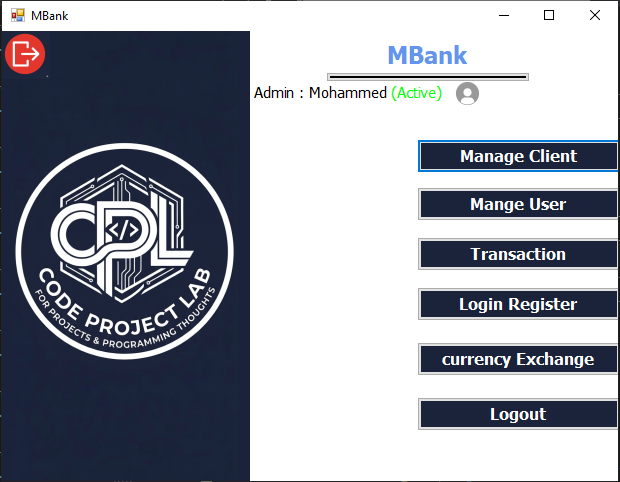
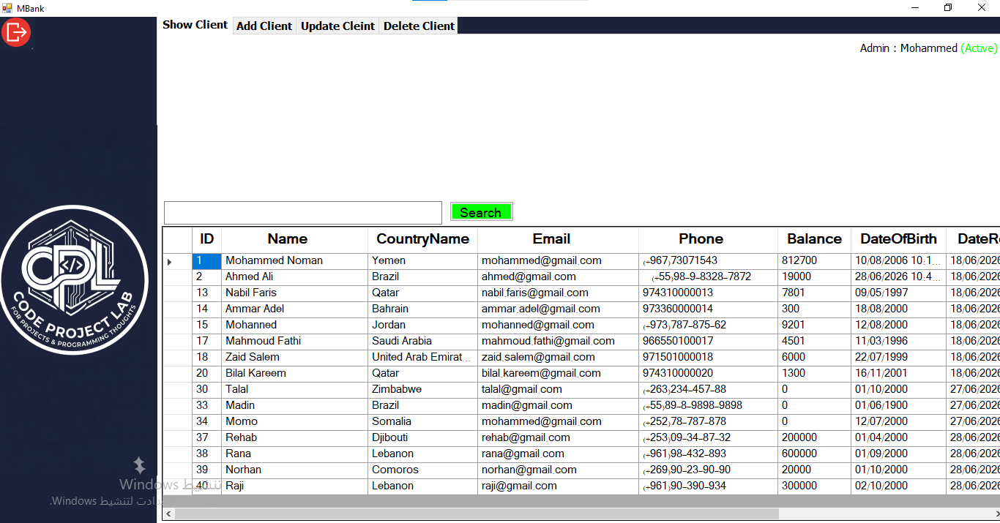
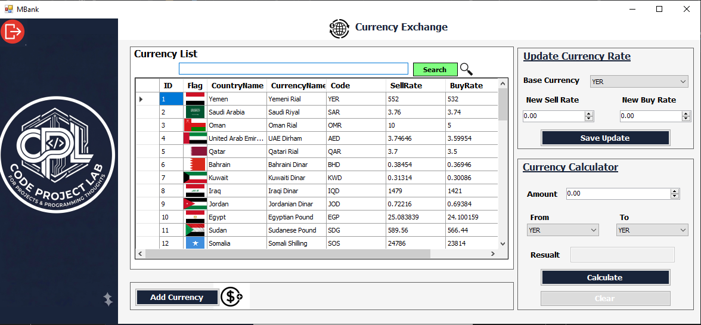
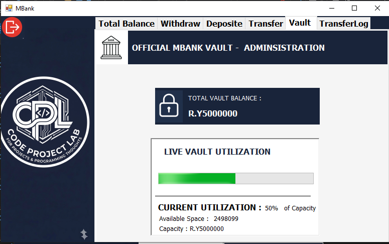

<div align="center">

# 🏦 MBank — v3.0.0

### A C# .NET Banking System

A simple banking project developed during the early stage of my programming journey.

<br>



<br><br>

[📖 About](#-about) ·
[📅 Timeline](#-project-timeline) ·
[✨ Features](#-features) ·
[🖼️ Screenshots](#️-screenshots) ·
[🛠️ Technologies](#️-technologies) ·
[📂 Structure](#-structure) ·
[🚀 Run](#-getting-started)

</div>

---

## 📖 About

**MBank v3.0.0** is a C# .NET banking application developed as the next stage of the MBank project.

This version marks the transition from the previous **C++ console-based projects** to **C# and Windows Forms**, introducing a graphical desktop interface.

The application uses **file-based storage** and focuses on banking logic, financial transactions, currency exchange, user access, and treasury management.

---

## 📅 Project Timeline

| Version | Started | Completed | Language |
|:---:|:---:|:---:|:---:|
| **v3.0.0** | **2026/03/18** | **2026/03/28** | **C#** |
| [v2.0.0](https://github.com/mohammedabdullahnomanqaid-maker/MBank-v2.0.0) | 2026/02/05 | 2026/02/20 | C++ |
| [v1.2.0](https://github.com/mohammedabdullahnomanqaid-maker/MBank-v1.2.0) | 2026/01/05 | 2026/01/10 | C++ |
| [v1.1.0](https://github.com/mohammedabdullahnomanqaid-maker/MBank-v1.1.0) | 2025/12/05 | 2025/12/10 | C++ |
| [v1.0.0](https://github.com/mohammedabdullahnomanqaid-maker/MBank-v1.0.0) | 2025/12/01 | 2025/12/04 | C++ |

---

## ✨ Features

The current project includes:

- 💱 Currency Calculation
- 🏦 Vault Logic
- 🛡️ Role-Based Access
- 🎨 Windows Forms Interface
- 💾 File-Based Storage

---

## 🖼️ Screenshots

### 📊 Dashboard

The main application interface.


<br>

<details>
<summary>🔐 Login</summary>

<br>


</details>

<details>
<summary>👥 Manage People</summary>

<br>



</details>

<details>
<summary>💱 Currency Exchange</summary>

<br>



</details>

<details>
<summary>🏦 Vault</summary>

<br>



</details>

> 💡 The Dashboard is displayed directly, while the other screenshots are placed inside expandable sections to keep the README clean.

---

## 🛠️ Technologies

| Technology | Usage |
|:---|:---|
| **C#** | Core programming language |
| **.NET Framework 4.7.2** | Application framework |
| **Windows Forms** | Desktop graphical interface |
| **File-Based Storage** | Data persistence |
| **Visual Studio** | Development environment |

---

## 📂 Structure

```text
MBank-v3.0.0/
│
├── Properties/
├── Resources/
├── Screenshots/
│   ├── Login.png
│   ├── Dashboard.png
│   ├── Manage-People.png
│   ├── CurrencyExchange.png
│   └── Vault.png
│
├── App.config
├── Program.cs
│
├── Form1.cs
├── Form1.Designer.cs
├── Form1.resx
│
├── FrmBankSystem.cs
├── FrmBankSystem.Designer.cs
├── FrmBankSystem.resx
│
├── FrmInterFace.cs
├── FrmInterFace.Designer.cs
├── FrmInterFace.resx
│
├── FrmManageUser.cs
├── FrmManageUser.Designer.cs
├── FrmManageUser.resx
│
├── FrmTransaction.cs
├── FrmTransaction.Designer.cs
├── FrmTransaction.resx
│
├── frmLogin.cs
├── frmLogin.Designer.cs
├── frmLogin.resx
│
├── frmCurrencyExchange.cs
├── frmCurrencyExchange.Designer.cs
├── frmCurrencyExchange.resx
│
├── FrmAddCurrency.cs
├── FrmAddCurrency.Designer.cs
├── FrmAddCurrency.resx
│
├── ClsAccountBalance.cs
├── Class1.cs
│
├── Project_Bank_C.csproj
├── Project_Bank_C.csproj.user
├── Project_Bank_C.sln
│
├── IcoBank.ico
├── MBankico.ico
└── .gitignore
```

---

## 🚀 Getting Started

### Requirements

- Windows
- Visual Studio
- C# / .NET development tools

### Run

1. Open `Project_Bank_C.sln`
2. Build the project
3. Run the application

---

## 🎓 Learning Journey

**v3.0.0** represents a major step in my programming journey.

After building the previous MBank versions using **C++ console applications**, this version was an opportunity to move into **C# and Windows Forms**.

It helped me continue learning through a more visual and structured application.

**C# · .NET · Windows Forms · OOP · File Handling · Financial Logic · User Access**

> 🌱 From a simple console project to a graphical banking application.

---

## 👨‍💻 Author

<div align="center">

### Mohammed Abdullah Noman Qaid Mohammed

Computer Science Student — Taiz University

<br>

🏦 **MBank v3.0.0**

*C# was the next step.*

</div>| **Windows Forms** | Desktop graphical interface |
| **File-Based Storage** | Data persistence |
| **Visual Studio** | Development environment |

---

## 📂 Structure

```text
MBank-v3.0.0/
│
├── Properties/
├── Resources/
├── Screenshots/
│   ├── Login.png
│   ├── Dashboard.png
│   ├── Manage-People.png
│   ├── CurrencyExchange.png
│   └── Vault.png
│
├── App.config
├── Program.cs
│
├── Form1.cs
├── Form1.Designer.cs
├── Form1.resx
│
├── FrmBankSystem.cs
├── FrmBankSystem.Designer.cs
├── FrmBankSystem.resx
│
├── FrmInterFace.cs
├── FrmInterFace.Designer.cs
├── FrmInterFace.resx
│
├── FrmManageUser.cs
├── FrmManageUser.Designer.cs
├── FrmManageUser.resx
│
├── FrmTransaction.cs
├── FrmTransaction.Designer.cs
├── FrmTransaction.resx
│
├── frmLogin.cs
├── frmLogin.Designer.cs
├── frmLogin.resx
│
├── frmCurrencyExchange.cs
├── frmCurrencyExchange.Designer.cs
├── frmCurrencyExchange.resx
│
├── FrmAddCurrency.cs
├── FrmAddCurrency.Designer.cs
├── FrmAddCurrency.resx
│
├── ClsAccountBalance.cs
├── Class1.cs
│
├── Project_Bank_C.csproj
├── Project_Bank_C.csproj.user
├── Project_Bank_C.sln
│
├── IcoBank.ico
├── MBankico.ico
└── .gitignore
```

---

## 🚀 Getting Started

### Requirements

- Windows
- Visual Studio
- C# / .NET development tools

### Run

1. Open `Project_Bank_C.sln`
2. Build the project
3. Run the application

---

## 🎓 Learning Journey

**v3.0.0** represents a major step in my programming journey.

After building the previous MBank versions using **C++ console applications**, this version was an opportunity to move into **C# and Windows Forms**.

It allowed me to continue learning through a more visual and structured application while working with:

**C# · .NET · Windows Forms · File Handling · OOP · Financial Logic · User Access**

> 🌱 From a simple console project to a graphical banking application.

---

## 📜 License

This project is open-source and available under the **MIT License**.

---

## 👨‍💻 Author

<div align="center">

### Mohammed Abdullah Noman Qaid Mohammed

Computer Science Student — Taiz University

<br>

🏦 **MBank v3.0.0**

*C# was the next step.*

</div>
